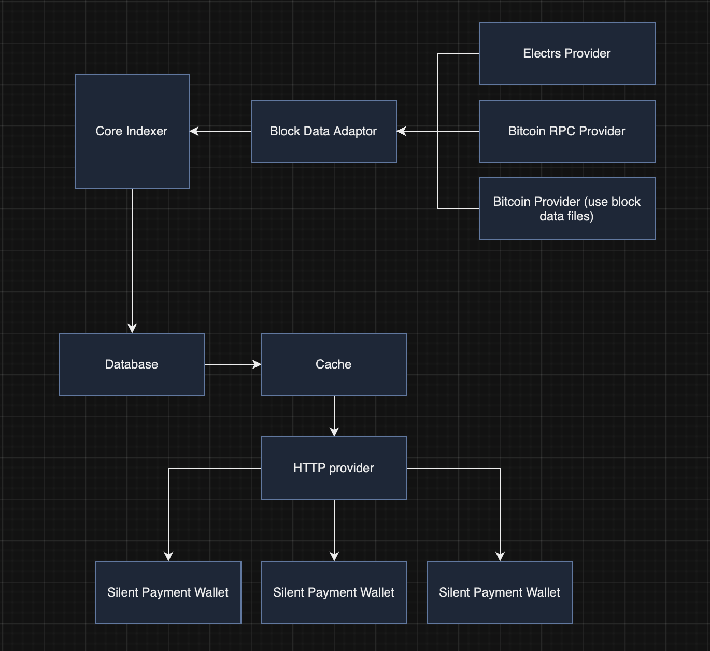

# Silent Payment Indexer

---

## Overview of indexer

The silent payment indexer should serve a silent payment index for each block.
For each block the indexer serves data in a compact block style format (referred to as *“silent block”*).
The silent block is designed to contain everything that a silent payment wallet needs to scan and spend outputs.
The indexer should update the old silent block once the outputs generated in that block are spent.

---

### Scanning

In order to scan for a silent payment in a wallet, we just need a `scan_tweak`.
The `scan_tweak` is calculated as `input_hash·A` (here `inputHash` and `A` have the same meaning as defined in [BIP 352](https://github.com/josibake/bips/blob/silent-payments-bip/bip-0352.mediawiki)).
The wallet uses it’s `b_scan` to calculate `ecdh_shared_secret = scan_tweak·b_scan` which can be used for scanning as defined in [BIP 352](https://github.com/josibake/bips/blob/silent-payments-bip/bip-0352.mediawiki).

### Spending

After detecting a payment the wallet can save the tweak `tk` along with `OutPoint` and value of that UTXO which is enough for spending that UTXO.
We don’t need to store the `script_pub_key` because if we have the private key, we can generate the P2TR `script_pub_key` for the corresponding private key.

---

## Specification for silent block

- It contains only unspent outputs created in that block.
- It contains the following items for each transaction in a block:
    - `txid` of the transaction
    - `pub_key` (not `script_pub_key`, just 32 byte x-only public key) of each eligible silent payment output (silent payment outputs are always P2TR)
    - `vout` of each eligible silent payment output
    - `value` of each silent payment output
    - `scan_tweak` for the transaction.
- All encodings are done in big endian : )
- Each transaction data is serialised as follows:
    - 32 byte txid
    - A varint encoding the number of eligible silent payment outputs followed by information about each output.
    - Each output contains the following information:
        - 8 byte value of the output
        - 32 byte `pub_key`
        - 1 byte `vout`
    - 33 byte `scan_tweak`
- Silent block is serialised as follows:
    - One byte big-endian encoded silent block type.
    - A varint specifying the number of transactions in a silent block.
    - Each transaction is encoded as specified above.

---

## Implementation Details

### High Level Design

- **Provider:** A provider provides all the necessary data required by the core indexer to create and update silent payment indexes. The data can be pulled from various sources and each source will have it’s own provider.
    - **Electrs:** This provider uses data files from electrs.
    - **Bitcoin RPC:** This provider connects to a bitcoin full node and uses RPC to pull data from it.
    - **Bitcoin:** This provider uses block data files (blk*.dat and rev*.dat) files.
- **Block Data Adaptor:**  Manages different data sources.
- **Core Indexer:** Generates, saves and updates silent payment indexes.